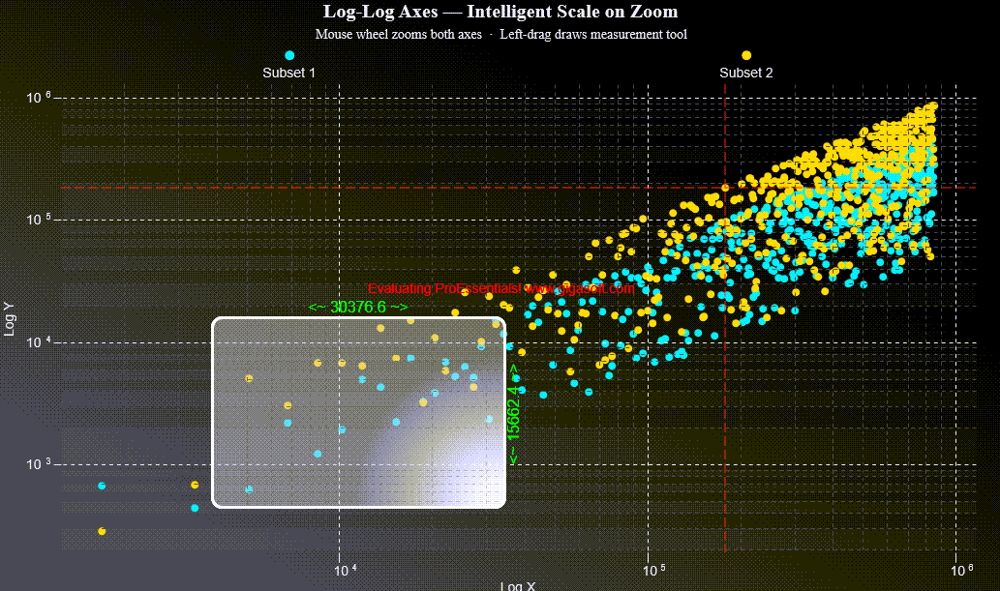

# ProEssentials WinUI — Log-Log Axes & Quick Annotation Drag Measure

A ProEssentials v11 WinUI 3 .NET 10 demonstration of two advanced `PesgoWinUI`
features: intelligent logarithmic axes that restructure intelligently on zoom,
and a live drag measurement tool built with the Quick Annotation mechanism.



➡️ [gigasoft.com/examples](https://gigasoft.com/examples)

---

## What This Demonstrates

| Feature | How to See It |
|---------|---------------|
| **Log-Log axes** | Scroll the mouse wheel — watch grid lines restructure at decade boundaries as you zoom through orders of magnitude |
| **Quick Annotation drag measure** | Left-click and drag — a live measurement rectangle appears showing X and Y deltas, updated every pointer move with no chart rebuild |

---

## ProEssentials Features Demonstrated

### Log-Log Axes

Both axes use `ScaleControl.Log`. ProEssentials selects intelligent
logarithmic grid numbers automatically at any zoom level, always landing on
clean powers of ten and their subdivisions:

```csharp
Pesgo1.PeGrid.Configure.XAxisScaleControl = ScaleControl.Log;
Pesgo1.PeGrid.Configure.YAxisScaleControl = ScaleControl.Log;
```

Mouse wheel zooms both axes simultaneously:

```csharp
Pesgo1.PeUserInterface.Allow.Zooming = AllowZooming.None; // left-drag reserved for measurement
Pesgo1.PeUserInterface.Scrollbar.MouseWheelFunction = MouseWheelFunction.HorizontalVerticalZoom;
Pesgo1.PeUserInterface.Scrollbar.MouseWheelZoomSmoothness = 8;
```

---

### Quick Annotation Drag Measurement Tool

Quick annotations are graph annotations that render via an optimized overlay
path, avoiding full chart rebuilds. They are ideal for transient UI that
updates on every pointer move.

#### Required Setup

In WinUI, `PesgoWinUI` automatically manages the `CacheBmp2` secondary buffer
and improved cursor rendering — `CacheBmp2` is not exposed on the WinUI
interface at all and requires no explicit setup.

The only mouse wheel zoom requirement is pairing `MouseWheelFunction` with
the matching scrollbar flags:

```csharp
Pesgo1.PeUserInterface.Scrollbar.ScrollingHorzZoom  = true;
Pesgo1.PeUserInterface.Scrollbar.ScrollingVertZoom  = true;
Pesgo1.PeUserInterface.Scrollbar.MouseWheelFunction = MouseWheelFunction.HorizontalVerticalZoom;
```

`MouseWheelFunction.HorizontalVerticalZoom` requires both flags set explicitly —
without them the wheel cannot zoom out and only one axis responds.

#### Negative Type Formula

Any `GraphAnnotationType` value becomes a quick annotation by negating it:

```csharp
// Normal annotation — baked into cached image, requires ResetImage to change:
Graph.Type[i] = (int)GraphAnnotationType.TopLeft;

// Quick annotation — overlay only, no chart rebuild needed:
Graph.Type[i] = ((int)GraphAnnotationType.TopLeft + 1) * -1;
```

When `ShowingQuickAnnotations = true`, only negative-type annotations are
rendered, drawn on top of the primary cached chart image.

#### Measurement Overlay — 6 Annotations

| Index | Type | Purpose |
|-------|------|---------|
| [0] | `TopLeft` (negative) | Top-left bound of the selection rectangle |
| [1] | `BottomRight` (negative) | Bottom-right bound |
| [2] | `RoundRectFill` (negative) | Semi-transparent filled background |
| [3] | `RoundRectMedium` (negative) | White border outline |
| [4] | `NoSymbol` + `\|c` text (negative) | X-delta label, centered horizontally |
| [5] | `NoSymbol` + `\|D` text (negative) | Y-delta label, centered vertically (right edge) |

#### Showing and Hiding

```csharp
// PointerMoved — trigger overlay redraw (no chart rebuild):
Pesgo1.PeAnnotation.ShowingQuickAnnotations = true;
Pesgo1.Invalidate();
Pesgo1.UpdateLayout();

// PointerReleased — clear overlay:
Pesgo1.PeAnnotation.ShowingQuickAnnotations = false;
Pesgo1.PeAnnotation.HidingQuickAnnotations  = true;
Pesgo1.Invalidate();
Pesgo1.UpdateLayout();
```

The WPF twin calls `Refresh()` where this sample calls `UpdateLayout()` —
`Invalidate()` is what schedules the WinUI repaint.

#### Log-Scale Label Centering

On log axes the visual center of a span is the geometric mean, not the
arithmetic mean. Delta labels use geometric centering so they appear
visually centered within the selection at any zoom level:

```csharp
double centeredXLog = (Math.Log10(fX) + Math.Log10(_dragStartX)) / 2.0;
double centeredX    = Math.Pow(10.0, centeredXLog);
```

#### Text Justification Codes

| Code | Meaning |
|------|---------|
| `\|c` | Centered horizontally, bottom anchor (text above the point) |
| `\|D` | Centered vertically on right side — 90° rotated text, right edge |

---

### ConvPixelToGraph — Pixel to Data Coordinates

Pointer pixel positions are converted to data-unit coordinates using
`ConvPixelToGraph`, then clamped to the visible axis extents:

```csharp
int nA = 0, nX = (int)pt.X, nY = (int)pt.Y;
double fX = 0, fY = 0;
Pesgo1.PeFunction.ConvPixelToGraph(ref nA, ref nX, ref nY,
                                    ref fX, ref fY, false, false, false);

// Clamp to current visible range
fX = Math.Max(Pesgo1.PeGrid.Configure.ManualMinX,
     Math.Min(Pesgo1.PeGrid.Configure.ManualMaxX, fX));
```

`ManualMinX/MaxX/MinY/MaxY` are only valid after the chart has rendered
its first image — never read them during initialization.

---

### Pointer Events in WinUI

`PesgoWinUI` forwards pointer input to the native engine in its own
`PointerPressed` / `PointerMoved` / `PointerReleased` handlers and then marks
the event handled. Attach with `AddHandler(..., handledEventsToo: true)` so
your handlers still run — the control's handler runs first, so
`PeUserInterface.Cursor.LastMouseMove` is already current when you read it:

```csharp
Pesgo1.AddHandler(UIElement.PointerPressedEvent,
                  new PointerEventHandler(Pesgo1_MouseDown), true);
```

`System.Windows.Point` / `Rect` become `Windows.Foundation.Point` / `Rect`,
and `System.Windows.Media.Color` becomes `Windows.UI.Color` — the `FromArgb`
signature is unchanged.

---

## Controls

| Input | Action |
|-------|--------|
| Mouse wheel | Zoom both axes (log-scale aware, smooth) |
| Left-click drag | Live drag measurement overlay |
| Right-click | Context menu — export, print, customize |

---

## Prerequisites

- Visual Studio 2026 with the **.NET desktop development** and
  **Windows application development** workloads
- .NET 10 SDK
- Internet connection for NuGet restore

> **No XAML designer:** Visual Studio has no XAML designer for WinUI 3 in any
> edition, so the chart is declared in markup rather than dragged from the
> Toolbox. That is a Windows App SDK limitation, not a ProEssentials one.
> Nothing needs to be installed beyond the NuGet packages for this project
> to build and run.

---

## How to Run

```
1. Clone this repository
2. Open LogLogDragMeasureWinUI.sln in Visual Studio 2026
3. Build → Rebuild Solution (NuGet restore is automatic)
4. Press F5
```

---

## NuGet Package

References
[`ProEssentials.Chart.Net10.WinUI`](https://www.nuget.org/packages/ProEssentials.Chart.Net10.WinUI).
Package restore is automatic on build.

The AnyCpu package embeds the native rendering engines inside the assembly and
unpacks the one matching the running process at run time, so there is no native
DLL to copy or deploy alongside your app. It also carries the control's `.pri`,
whose resources are merged into your app's own `.pri` at build time.

The nuget.org package is the evaluation build and draws an "Evaluating
ProEssentials" watermark across the chart. A licensed installation replaces the
assembly and the watermark goes away — performance and behavior are identical.

---

## Deploying a WinUI App

WinUI deploys differently than WPF and WinForms:

- A .NET app is **not a single exe** — ship the entire build or publish output
  folder, never a hand-picked subset.
- The target machine needs **two** runtimes: the .NET 10 Desktop Runtime **and**
  the Windows App SDK Runtime. Or publish self-contained with
  `-p:WindowsAppSDKSelfContained=true`.
- Your development machine already has both, so it will run from an under-filled
  folder. Always validate on a clean machine.

---

## Related Examples

- [WPF version — wpf-chart-log-log-axes-drag-measure-quick-annotations-proessentials](https://github.com/GigasoftInc/wpf-chart-log-log-axes-drag-measure-quick-annotations-proessentials)
- [WinUI Chart Quickstart](https://github.com/GigasoftInc/winui-chart-quickstart-proessentials)
- [All Examples — GigasoftInc on GitHub](https://github.com/GigasoftInc)
- [Full Evaluation Download](https://gigasoft.com/net-chart-component-wpf-winforms-download)
- [gigasoft.com](https://gigasoft.com)

---

## License

Example code is MIT licensed. ProEssentials requires a commercial
license for continued use.
